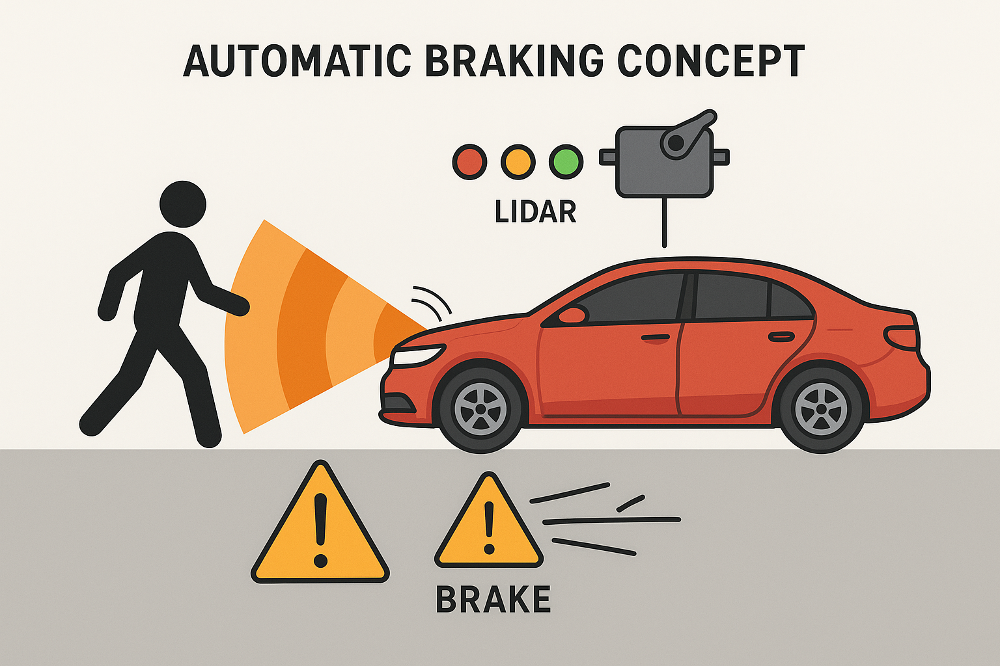

# 🚗 Brake Buddy - Smart Auto Braking System

**Brake Buddy** is a smart prototype system designed to assist drivers by automatically applying brakes if they fail to respond to an approaching obstacle. It uses a **TF-Luna LiDAR** sensor to detect distance, a **servo motor** to simulate brake activation, **LEDs** for visual distance indication, and a **buzzer** for audio alerts.

---

## 🧠 How It Works

- The TF-Luna LiDAR sensor continuously measures the distance in front of the vehicle.
- Based on the detected distance, the system performs the following actions:

| Distance       | Action                              | LED Indicator | Servo Angle | Buzzer |
|----------------|--------------------------------------|---------------|--------------|--------|
| < 30 mm        | Ignored (possibly noise)             | Off           | 0°           | Off    |
| 30–300 mm      | 🚨 Danger – Obstacle very close       | 🔴 Red        | 90°          | On     |
| 300–600 mm     | ⚠️ Warning – Obstacle approaching     | 🟡 Yellow     | 0°           | Off    |
| > 600 mm       | ✅ Safe – No nearby obstacle          | 🟢 Green      | 0°           | Off    |

- **Red LED** turns on in danger, **Yellow** for warning, **Green** when safe.
- **Servo motor** rotates to simulate brake pressing.
- **Buzzer** sounds an alarm in danger zone.

---

## 🛠 Hardware Components

- 🔍 TF-Luna LiDAR Sensor (UART)
- ⚙️ Servo Motor
- 🔴🟡🟢 3 LEDs: Red, Yellow, Green
- 🔊 Buzzer
- 🧠 Arduino Uno (or compatible board)
- Breadboard, resistors, jumper wires

---

## 📁 Project Structure

## 🖧 Circuit Diagram
 

> *The image diagram shows the complete Brake Buddy setup with LEDs, servo, LiDAR sensor, and buzzer on a breadboard.*

---

## ⚙️ Pin Configuration

| Component     | Arduino Pin |
|---------------|-------------|
| LiDAR RX/TX   | 2 (RX), 3 (TX) |
| Red LED       | 10          |
| Yellow LED    | 5           |
| Green LED     | 6           |
| Buzzer        | 8           |
| Servo Motor   | 9           |

---

## 🚀 How to Use

1. **Connect the hardware** as per the pin configuration above.
2. **Upload** `BrakeBuddy.ino` to your Arduino board using the Arduino IDE.
3. **Power on** the system and observe:
   - The **LEDs** will show the obstacle range.
   - The **servo motor** will act if an object comes dangerously close.
   - The **buzzer** will sound in case of emergency.

---

## 📷 Demo

---

## ⚠️ Disclaimer

This is a **prototype for educational purposes only**. It is **not intended for use in real vehicles** without extensive engineering validation and safety certifications.

---

## 📜 License

This project is licensed under the [MIT License](https://opensource.org/licenses/MIT). Feel free to use, modify, and share with attribution.

---

## 🤝 Contributing

Pull requests and suggestions are welcome! You can:
- Improve the servo response logic
- Add LCD or OLED display support
- Integrate with Bluetooth or mobile apps

# ✨ Thank you for checking out my project!

